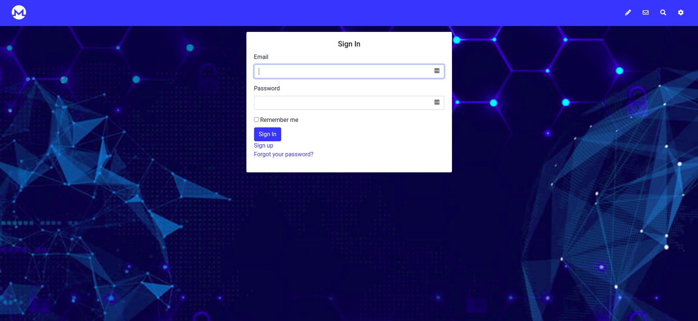
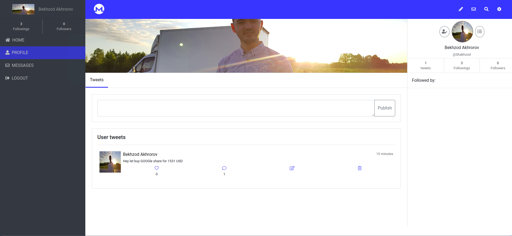
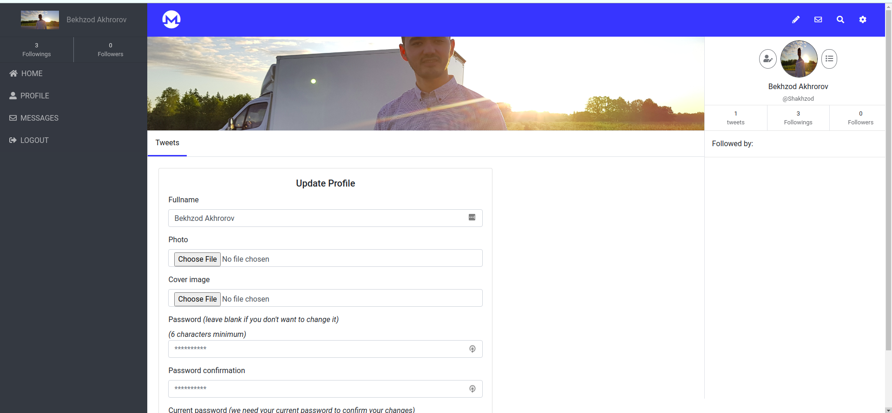

# Stock Tweeter Application

> In this application I created a social platform where users could share stock price and exchange real time information in Stock Exchange Market. User can follow to other user and he/she could write real time message to the followed user in platform.  

## Live view  - - [Stock-Twitter](http://stock-tweeter.herokuapp.com/) - -

## Presentation of the Application - - [Stock-Twitter](https://www.loom.com/share/4097e74eb8a14bf585fa8c3c7e332c1f) - - 








### Prerequisites

Ruby: 2.7.0
Rails: 5.2.3
Postgres: >=9.5

### Build with

- Ruby
- Ruby on Rails
- ActionCable
- Redis
- ActiveStorage
- Bootstrap
- SCSS
- HTML
- JavaScript
- JQuery

### Getting Started

In order to start with the project:

1. You need to have Rails environment installed. [Click here for instructions](https://github.com/Bekhzod96/stock-tweeter.git)
2. Clone [this repository stock-tweeter ](https://github.com/Bekhzod96/stock-tweeter.git)
3. Check your Ruby and Rails version should be corresponding to project version, if not run these command to
    - rbenv install 5.2.3
    - gem install bundler
    - rbenv rehash
    - gem install rails
    - rbenv rehash

4. Run the migration to database

`````
    - rails db:migrate
`````

5. Run the rails server

`````
    - rails server
`````

### Run tests

```
    rspec --format documentation
```
## Authors

👤 **Bekhzod Akhrorov**

- Github:[@Bekhzod96](https://github.com/Bekhzod96)
- Twitter: [@Begzod](https://twitter.com/25d47e8987f740b)
- Linkedin:[@Bekhzod AKhrorov](https://www.linkedin.com/in/bekhzod-akhrorov/)


## 🤝 Contributing

Contributions, issues and feature requests are welcome!

Feel free to check the [issues page](issues/).

## Show your support

Give a ⭐️ if you like this project!

## Acknowledgments

## 📝 License

TBA

